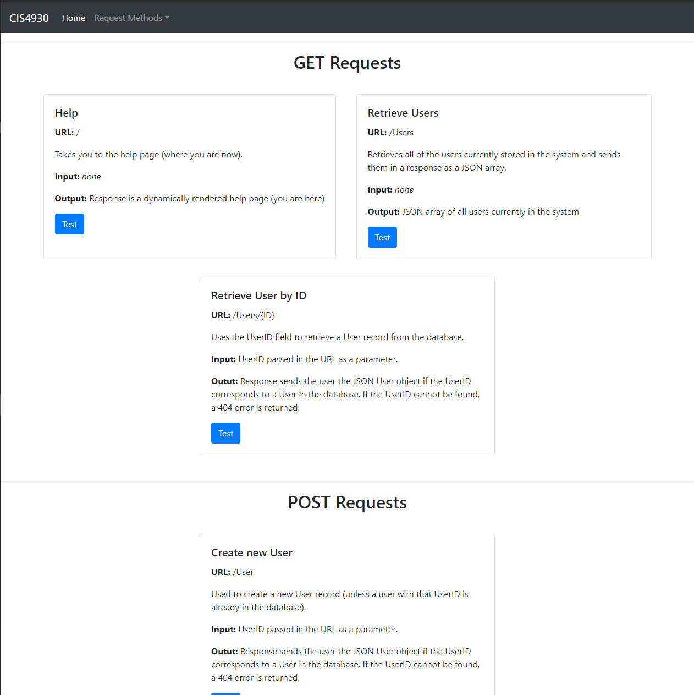

# API Overview
## Setup

 1. Start the TypeScript compiler in watch mode from a terminal inside of the Assignment 2 directory using <code>tsc -w</code>
 2. Startup the node <code>nodemon</code> tool which will start the <code>dist/index.js</code> javascript file that has been compiled from the latest saved version of the <code>src/index.ts</code> TypeScript file
 3. In your browser, navigate to <code>localhost:3000</code>
## Usage

- Shown above is the default route for the application. Navigating to <code>localhost:3000/</code> will result in an express